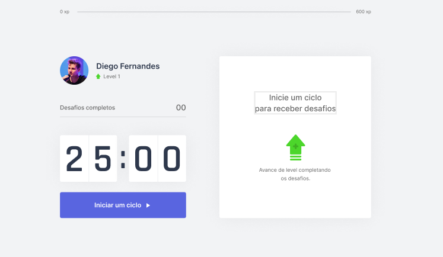

# Move.it

<p>
  
  
  
  <a href="https://github.com/paulofl/moveit/commits/master">
    
  </a>
</p>


## Tópicos 

[Sobre](#sobre)

[Tecnologias](#tecnologias)

[Instalação e uso](#instalação-e-uso)

<br>

## Sobre o Move.it

Com o Move.it você poderá melhorar seu foco e produtividade em qualquer atividade do dia a dia, através da técnica de [pomodoro](https://pt.wikipedia.org/wiki/T%C3%A9cnica_pomodoro), de uma maneira simnples e divertida.
Desenvolvido durante a NLW#4 da [Rocketseat](https://rocketseat.com.br/).

<br>

<p>
  <a href="https://www.figma.com/file/ge20pu3ofMOKoliUyKx1Nl/Move.it-1.0/duplicate?node-id=160%3A2761">
    
  </a>
</p>

<br>

<p align="center">
  
</p>

## Tecnologias

Tecnologias e ferramentas utilizadas no desenvolvimento do projeto:

- [React](https://reactjs.org/)
- [Next.js](https://nextjs.org/)
- [TypeScript](https://www.typescriptlang.org/)
- [Styled Components](https://styled-components.com/)

<br>

## Instalação e uso

```bash
# Abra um terminal e copie este repositório com o comando
$ git clone https://github.com/paulofl/moveit.git
# ou use a opção de download.

# Entre na pasta web com 
$ cd moveit

# Instale as dependências
$ yarn install

# Rode o aplicação
$ yarn start
```

<br>

---

Feito com :heart: by [Paulo Fernando](https://github.com/paulofl)

[](https://www.linkedin.com/in/paulocornelio/) 
[](mailto:paulofernandocornelio@gmail.com)
